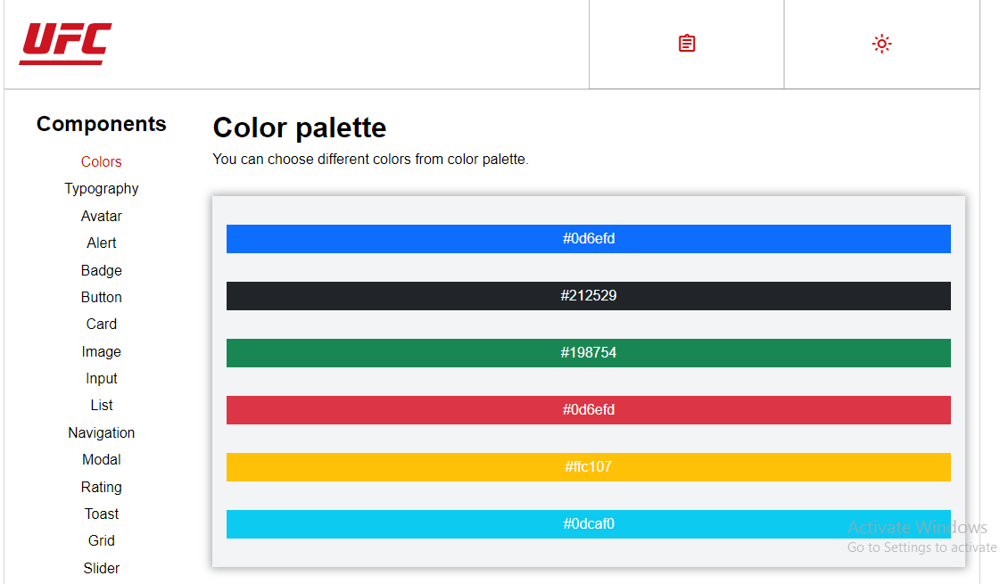
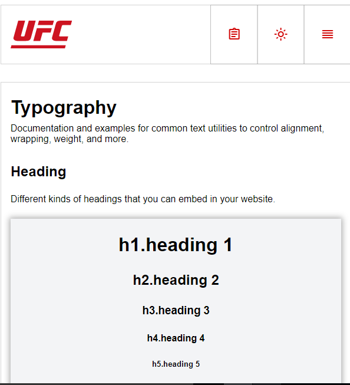
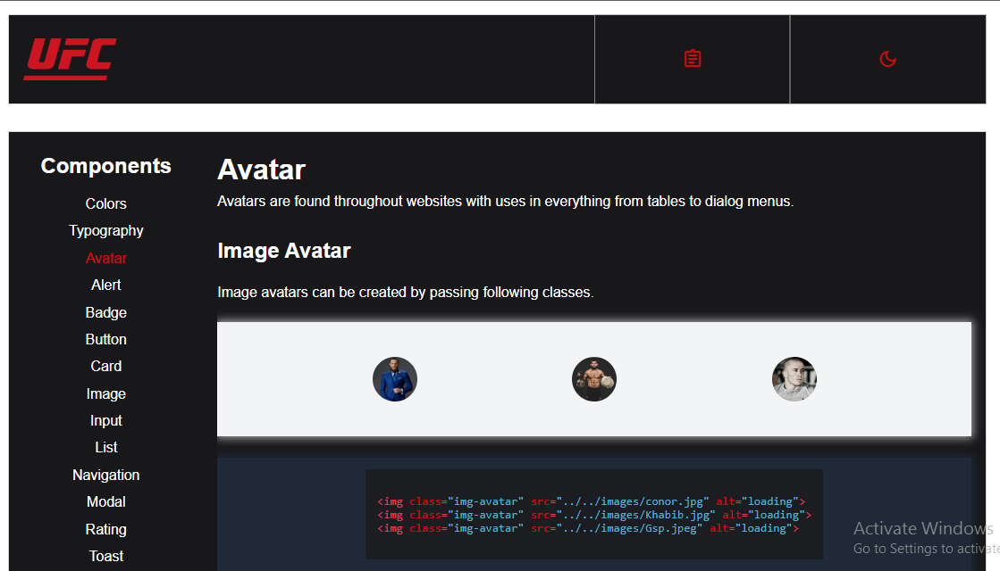
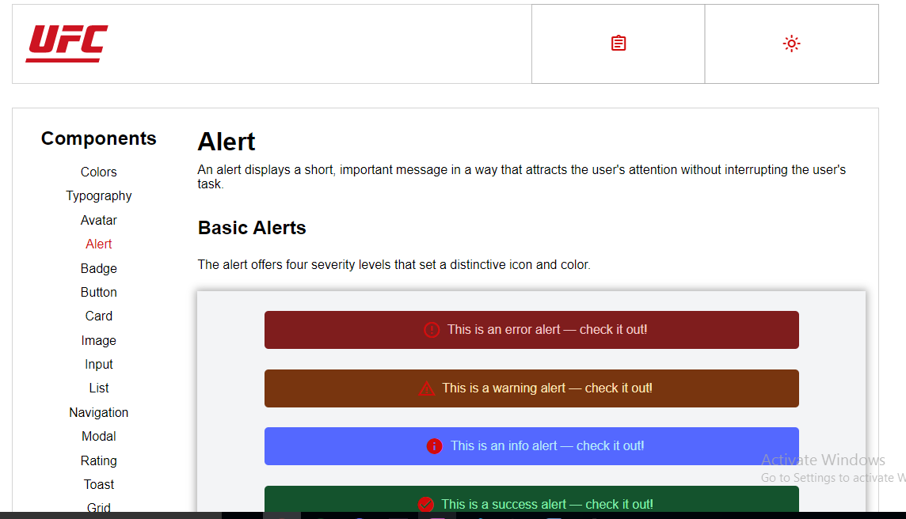
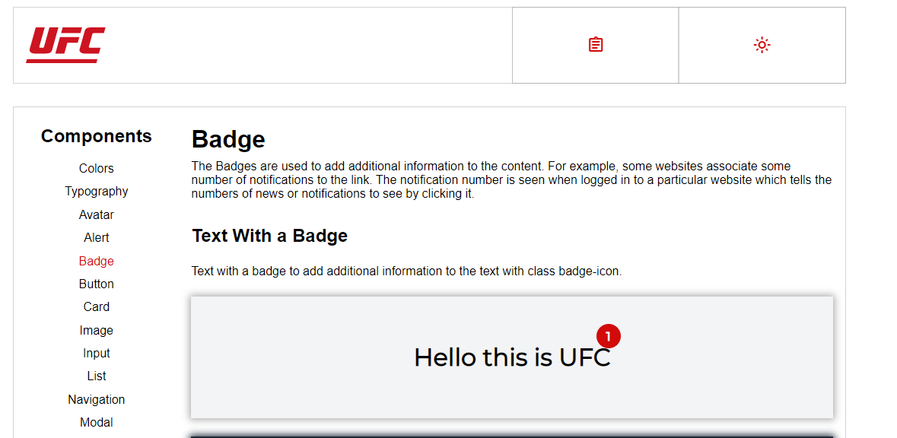
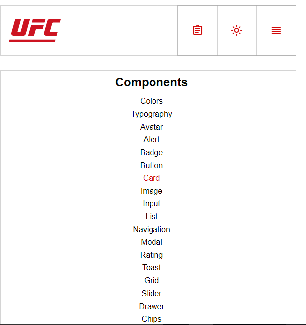
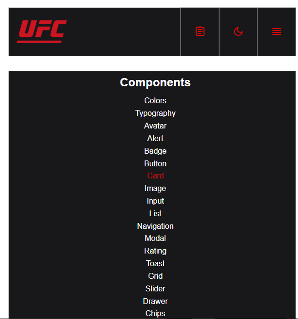
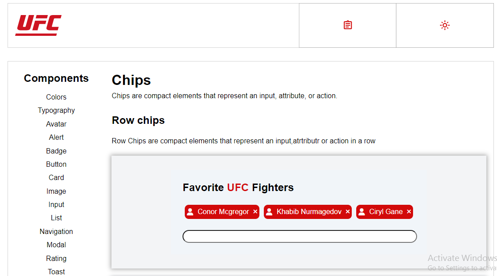

# UFC-componentLibrary
+ UFCComponentLibrary is a CSS Library that will provide you different components and help you build different websites with different designs directly in your markup.  
+ It currently has 18 components with different variations.
+ It has Two modes dark'mode and light mode.
+ It is open source and anyone can contribute.
+ It is responsive.

## Components
+ [Colors](https://ufc-componentlibrary.netlify.app/components/colors/colors.html)
+ [Typography](https://ufc-componentlibrary.netlify.app/components/typography/typography)
+ [Avatar](https://ufc-componentlibrary.netlify.app/components/avatar/avatar)
+ [Alert](https://ufc-componentlibrary.netlify.app/components/alert/alert)
+ [Badge](https://ufc-componentlibrary.netlify.app/components/badge/badge)
+ [Button](https://ufc-componentlibrary.netlify.app/components/button/button)
+ [Card](https://ufc-componentlibrary.netlify.app/components/card/card)
+ [Image](https://ufc-componentlibrary.netlify.app/components/image/image)
+ [Input](https://ufc-componentlibrary.netlify.app/components/input/input)
+ [List](https://ufc-componentlibrary.netlify.app/components/list/list)
+ [Navigation](https://ufc-componentlibrary.netlify.app/components/navigation/navigation)
+ [Modal](https://ufc-componentlibrary.netlify.app/components/modal/modal)
+ [Rating](https://ufc-componentlibrary.netlify.app/components/rating/rating)
+ [Toast](https://ufc-componentlibrary.netlify.app/components/toast/toast)
+ [Grid](https://ufc-componentlibrary.netlify.app/components/grid/grid)
+ [Slider](https://ufc-componentlibrary.netlify.app/components/slider/slider)
+ [Drawer](https://ufc-componentlibrary.netlify.app/components/drawer/drawer)
+ [Chips](https://ufc-componentlibrary.netlify.app/components/chips/chips)

## [Live](https://ufc-componentlibrary.netlify.app/)

## Screenshots

