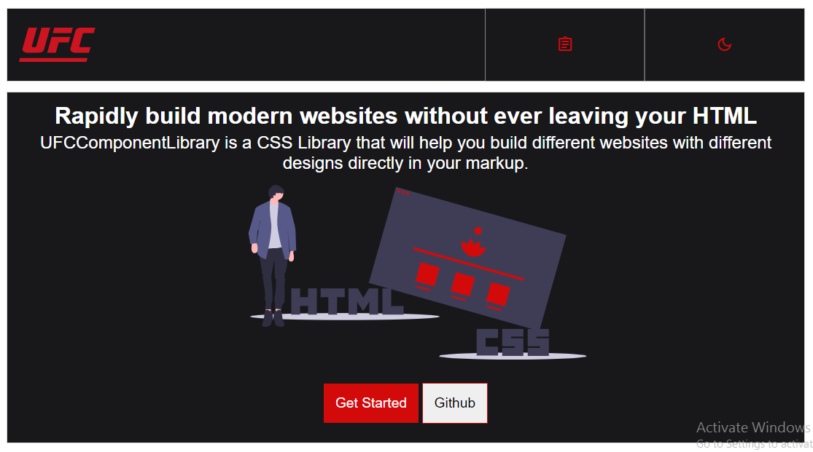

# UFC-componentLibrary
+ UFCComponentLibrary is a CSS Library that will provide you different components and help you build different websites with different designs directly in your markup.  
+ It currently has 18 components with different variations.
+ It has Two modes dark'mode and light mode.
+ It is open source and anyone can contribute.
+ It is responsive.

#Components
+ [Colors]()
+ [Typography]()
+ [Avatar]()
+ [Alert]()
+ [Badge]()
+ [Button]()
+ [Card]()
+ [Image]()
+ [Input]()
+ [List]()
+ [Navigation]()
+ [Modal]()
+ [Rating]()
+ [Toast]()
+ [Grid]()
+ [Slider]()
+ [Drawer]()
+ [Chips]()

#Screenshots

